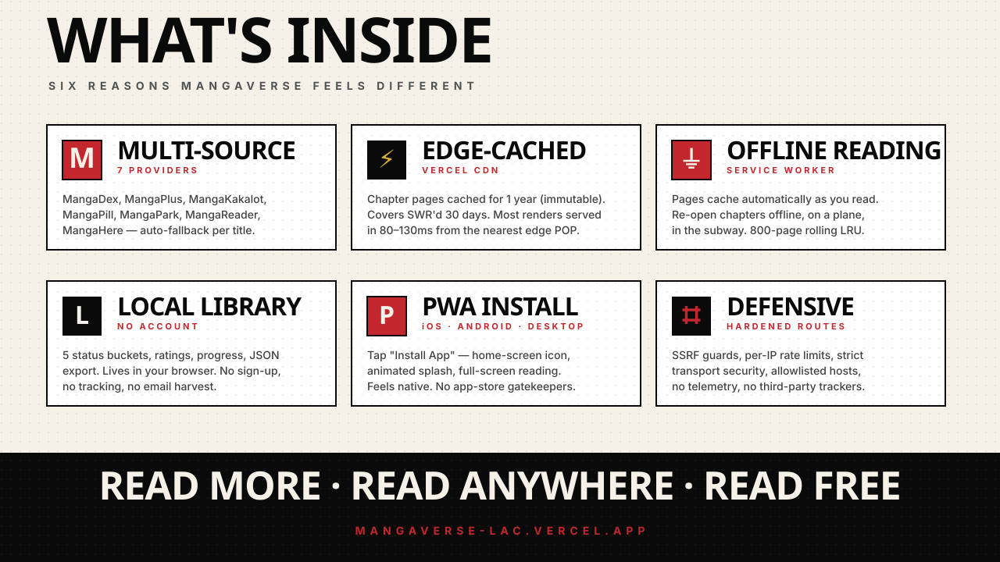

<div align="center">

<a href="https://mangaverse-lac.vercel.app">
  
</a>

<br/>

[](https://mangaverse-lac.vercel.app)
[](https://nextjs.org)
[](https://mangaverse-lac.vercel.app/about)
[](LICENSE)
[](https://www.facebook.com/isDevGit)

<br/>

**[ ▸ Read Now ](https://mangaverse-lac.vercel.app/read-now) ·
[ ▸ Browse ](https://mangaverse-lac.vercel.app/browse) ·
[ ▸ Library ](https://mangaverse-lac.vercel.app/library) ·
[ ▸ About ](https://mangaverse-lac.vercel.app/about) ·
[ ▸ Source ](https://github.com/Get-shitdone/mangaverse)**

</div>

<br/>

---

## 漫画 — What is this?

**Mangaverse** is a free, ad-free reading platform for **manhwa, manga, comics, and novels** — built with Next.js 14 and a Jump-magazine-inspired interface. Every chapter streams from open sources. No accounts. No tracking. No paywalls.

It's a single library for every format. Discovery, reading, offline cache, install-as-an-app — all under one roof, all free forever.

<br/>

<div align="center">



</div>

<br/>

---

## 機能 — Features

| | |
|---|---|
| **🟥 Multi-source aggregator** | MangaDex · MangaPlus · MangaKakalot · MangaPill · MangaPark · MangaReader · MangaHere. Per-title source picker. Auto-fallback when one source is licensed-out. |
| **📚 Manhwa, manga, comics & novels** | AniList & Jikan power discovery. Project Gutenberg streams public-domain novel text. Comic Vine seeds the Western-comic canon. |
| **⚡ Edge-cached reading** | Chapter pages: `Cache-Control: public, max-age=31536000, immutable` — cached for a year by browser & Vercel edge. Covers SWR'd 30 days. Most renders served in 80–130ms. |
| **🌐 Offline reading** | Service worker caches pages as you read. Re-open chapters with the WiFi off — 800-page rolling LRU. |
| **📲 Installable PWA** | Animated boot splash, custom icons, app shortcuts, status-bar tinting. Works on iOS, Android, and desktop. |
| **🟠 Local library** | 5 status buckets (Reading · Plan · Completed · On Hold · Dropped). Star ratings, progress, JSON export/import. Lives in your browser. No account. |
| **🔔 Chapter notifications** | Background poller checks MangaDex every 5 min for your library's titles. Unread badge on the navbar bell. |
| **🔒 Defensive by default** | SSRF guards, per-IP rate limits, sanitized inputs, HSTS-preload, allowlisted hosts. See [SECURITY.md](SECURITY.md). |
| **🎌 Manga-native aesthetic** | Bebas Neue display type, Noto Serif JP kanji accents, vermillion + ink + cream palette, halftone dots, panel-grid layouts. |

<br/>

---

## 種類 — Routes

```
/                            home — hero, continue reading, trending, top manhwa
/read-now                    MangaDex-direct catalog with sort tabs
/browse                      AniList catalog with type/genre/status/sort filters
/comics                      curated Western comic canon + Comic Vine
/genre/[name]                hero + manhwa/fresh/novel rails per genre
/title/[id]                  detail page — chapters, characters, recs, JSON-LD
/read/[mediaId]/[chapterId]  manga/manhwa reader (paginated · double · webtoon)
/read-novel/[mediaId]        novel reader (cream · sepia · dark · type controls)
/library                     status tabs · ratings · progress
/library/stats               reading-time, completion rate, by-format chart
/library/settings            backup/restore JSON · clear offline cache · wipe
/notifications               new chapters across your library
/search                      type-ahead across all sources
/about                       project + developer info
/offline                     fallback shell when network is dead
/api/*                       proxy-image · search · recs · chapter-pages · download-cbz · og · chapters/updates
/feed.xml?library=...        personal RSS feed encoded with your library
/manifest.webmanifest · /sitemap.xml · /robots.txt · /sw.js
```

<br/>

---

## 技術 — Stack

```
Next.js 14 · App Router · TypeScript
Tailwind CSS · Zustand · Lucide icons
@vercel/og · @vercel/analytics · @vercel/speed-insights
Service worker · Web App Manifest · iOS startup-image
Vercel hosting · edge image cache · PWA install prompt
```

<br/>

---

## 設定 — Local development

```bash
npm install
npm run dev
```

Open [http://localhost:3000](http://localhost:3000).

Optional environment variables (everything works without them):

```bash
COMICVINE_API_KEY=        # richer comics catalog
GOOGLE_BOOKS_API_KEY=     # higher rate limits on novel previews
CONSUMET_API_BASE=        # self-hosted Consumet instance for chapter sources
```

Deploy to Vercel with one click:

```bash
npm i -g vercel && vercel
```

<br/>

---

## 出典 — Credits

<table>
<tr>
<td valign="top">

**Metadata**
- [AniList](https://anilist.co)
- [MyAnimeList / Jikan](https://jikan.moe)
- [Open Library](https://openlibrary.org)
- [Google Books](https://books.google.com)

</td>
<td valign="top">

**Chapters**
- [MangaDex](https://mangadex.org)
- [MangaPlus](https://mangaplus.shueisha.co.jp) (official)
- [Consumet](https://consumet.org) ecosystem

</td>
<td valign="top">

**Novels & Comics**
- [Project Gutenberg](https://gutenberg.org) (Gutendex)
- [Comic Vine](https://comicvine.gamespot.com)

</td>
</tr>
</table>

Cover art and chapter content remain copyright of their respective publishers. Mangaverse links and proxies — it does not host or claim ownership.

<br/>

---

<div align="center">

## 開発者 — Developer

<a href="https://www.facebook.com/isDevGit">
  
</a>
<a href="https://github.com/Get-shitdone">
  
</a>

<br/><br/>

Designed and built solo. If something feels off, [file an issue](https://github.com/Get-shitdone/mangaverse/issues/new).<br/>
Security reports go through [responsible disclosure](SECURITY.md).

<br/>

**Made with ink & pixels**

漫画宇宙 · 読書を楽しもう

[](LICENSE)

</div>
